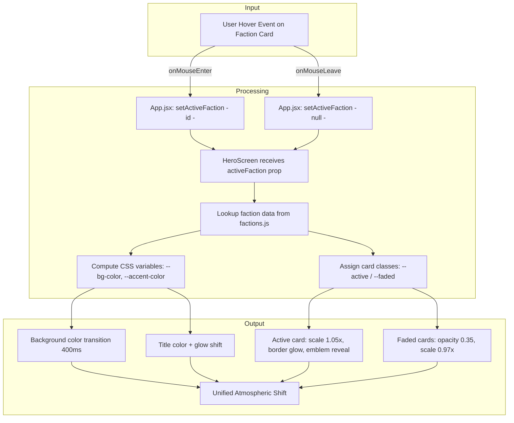

# Choose Your Red Flag

**AI 201 — Project 1**
Live URL: `https://rapoport21.github.io/Test/`

---

## Design Intent

> *Written before AI engagement — this is the standard against which all AI output is evaluated.*

**Mood:**
<!-- One sentence describing the overall atmosphere -->

**Color Palette:**
| Role | Value | Preview |
|------|-------|---------|
| Background (default) | `#111` | |
| Finance Bro accent | `#00ff88` | |
| Sleep-Deprived Prophet accent | `#9b59ff` | |
| Gym Bro accent | `#ff4444` | |
| Identity Crisis Millennial accent | `#ff69b4` | |

**Typography:**
- Display / Headers: Oswald, 700, uppercase, wide letter-spacing
- Body / Taglines: Inter, 300

**Hover-State Rules:**
<!-- Describe what happens when a user hovers over a faction -->
1. Background color transitions to that faction's `bgColor` over 400ms
2. Hovered card scales up (1.05×), border glows with accent color
3. Non-hovered cards fade to 35% opacity and scale down (0.97×)
4. Title accent color shifts to match hovered faction

**Non-Negotiables:**
<!-- What you will NOT compromise on -->

---

## Mermaid Diagram

---

## AI Direction Log

### Entry 1
- **What I asked:**
- **What AI produced:**
- **What I changed/rejected/kept & why:**

### Entry 2
- **What I asked:**
- **What AI produced:**
- **What I changed/rejected/kept & why:**

### Entry 3
- **What I asked:**
- **What AI produced:**
- **What I changed/rejected/kept & why:**

---

## Records of Resistance

### Resistance 1
- **What AI produced:**
- **Why I rejected/revised it:**
- **What I did instead:**

### Resistance 2
- **What AI produced:**
- **Why I rejected/revised it:**
- **What I did instead:**

### Resistance 3
- **What AI produced:**
- **Why I rejected/revised it:**
- **What I did instead:**

---

## Five Questions Reflection

1. **Can I defend this?**

2. **Is this mine?**

3. **Did I verify?**

4. **Would I teach this?**

5. **Is my documentation honest?**

---

*DISCLOSURE: AI (Claude, Anthropic) was used as a production tool under student direction per SCAD ESF Protocol.*
