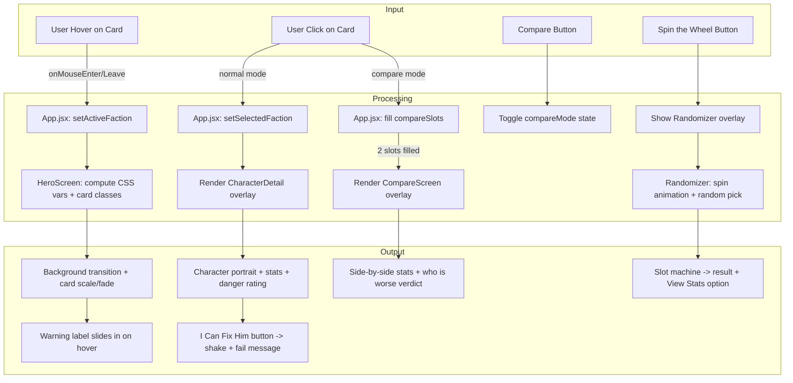

# Choose Your Red Flag

**AI 201 — Project 1**
Live URL: `https://rapoport21.github.io/Test/`

---

## Design Intent

> *Written before AI engagement — this is the standard against which all AI output is evaluated.*

**Mood:**
Dark, satirical dating-app energy — like a Tinder profile written by someone who knows the red flags but swipes right anyway. The UI should feel slick and moody with neon accents that scream "bad decision," leaning into dark humor rather than genuine romance.

**Color Palette:**
| Role | Value | Preview |
|------|-------|---------|
| Background (default) | `#111` | |
| Finance Bro accent | `#00ff88` | |
| Drug Addict accent | `#9b59ff` | |
| Gym Bro accent | `#ff4444` | |
| Identity Crisis Millennial accent | `#ff69b4` | |

**Typography:**
- Display / Headers: Oswald, 700, uppercase, wide letter-spacing
- Body / Taglines: Inter, 300

**Hover-State Rules:**
1. Background color transitions to that faction's `bgColor` over 400ms
2. Hovered card scales up (1.05x), border glows with accent color
3. Non-hovered cards fade to 35% opacity and scale down (0.97x)
4. Title accent color shifts to match hovered faction

**Non-Negotiables:**
- The humor has to come through — this isn't a serious character select screen, it's a joke about bad dating choices. If it reads as sincere, it's wrong.
- Every character needs to feel distinct at a glance — unique color, unique energy, unique stats.
- Interactions need payoff — clicking "I Can Fix Him" should be funny, not just functional.
- The design must stay dark/moody. No light mode, no pastels, no softening the vibe.

---

## Mermaid Diagram

---

## AI Direction Log

### Entry 1
- **What I asked:** Build the full project from scratch — React + Vite scaffold, GitHub Pages deployment, component architecture, and a "Choose Your Red Flag" themed character selector with 4 satirical dating archetypes.
- **What AI produced:** Complete project structure with HeroScreen, FactionCard, and CharacterDetail components. Set up the Vite config, GitHub Pages deploy pipeline, responsive CSS grid layout, and the full data model with character stats, accent colors, and taglines.
- **What I changed/rejected/kept & why:** Kept nearly everything. My approach for this project was to act as creative director and let AI handle execution. I provided the theme concept ("Choose Your Red Flag" as a satirical dating-app character selector), the four character archetypes, their stat values, and the AI-generated character images. AI made all the technical and visual design decisions — color choices, layout, animations, typography. I steered by reacting to output rather than specifying upfront.

### Entry 2
- **What I asked:** Add three interactive features at "medium effort" level — an "I Can Fix Him" button with a failure animation, a character comparison mode, and a "Wheel of Bad Decisions" randomizer.
- **What AI produced:** CharacterDetail got a shake animation with random sarcastic failure messages (7 options like "He got worse, actually." and "Your therapist just quit."). CompareScreen showed a VS layout with stat bars. Randomizer used a slot-machine style progressive-slowdown animation.
- **What I changed/rejected/kept & why:** Kept the "I Can Fix Him" button and randomizer as-is — they nailed the humor. Pushed back on the compare screen twice: first it merged all stats from both characters into one list (confusing since each character has unique stats), then it showed a "Toxic Synergy compatibility %" which didn't match what I wanted. I asked for it to show who's worse/better with a clear score, and the final version shows total points side-by-side with a verdict like "Finance Bro is the bigger red flag."

### Entry 3
- **What I asked:** Add "quick win" features — warning labels on hover, a Red Flag danger rating on the detail screen, and swipe interactions on cards.
- **What AI produced:** Each card now shows a red banner on hover with a unique satirical warning (e.g., "SURGEON GENERAL'S WARNING: This man will explain NFTs at dinner."). The detail panel got a pulsing "DANGER LEVEL: CRITICAL" badge. Cards support drag left (NOPE) / right (I CAN FIX HIM) like a dating app.
- **What I changed/rejected/kept & why:** Kept all three. The warning labels were the standout — they add personality without requiring a click. The danger rating levels (CRITICAL, EXTREME, SEVERE, UNSTABLE) were AI-chosen and fit each character well enough that I didn't adjust them.

### Entry 4
- **What I asked:** Originally the second character was called "Sleep-Deprived Prophet." I told AI to rename it to "Drug Addict" and swap in a new image.
- **What AI produced:** Updated the data file and all references. Also had to fix an incorrect gym bro image — AI initially grabbed the wrong file from the assets folder.
- **What I changed/rejected/kept & why:** This was one of the few times I gave a hard correction. The original "Sleep-Deprived Prophet" name didn't hit the same way. "Drug Addict" is more direct and funnier in the context of red flags. I also had to point out the wrong image file for Gym Bro — AI used a random generated image instead of the one I actually named "Gym.png."

---

## Records of Resistance

### Resistance 1
- **What AI produced:** The original compare screen merged all stat labels from both characters into one list and showed bidirectional bars. Since each character has completely different stats (e.g., Finance Bro has "Ego" and "Hair Product" while Gym Bro has "Strength" and "Protein Intake"), most rows showed 0 on one side — making the comparison confusing and meaningless.
- **Why I rejected/revised it:** It was hard to read and didn't actually help you compare anything. Seeing "Hair Product: 5 vs 0" doesn't tell you who's worse, it just tells you one character doesn't have that stat.
- **What I did instead:** Asked for a redesign with each character's stats in their own column, side by side, so you can scan each character independently and the center shows the total score verdict.

### Resistance 2
- **What AI produced:** The compare screen showed a "Toxic Synergy" compatibility percentage — as if the two characters were being matched together romantically.
- **Why I rejected/revised it:** The point of compare mode isn't to match characters together. It's to see who's a bigger red flag — who's worse. Compatibility missed the whole point.
- **What I did instead:** Replaced it with a total stat score comparison (e.g., 16 vs 20) and a verdict that names the winner: "Finance Bro is the bigger red flag." Clear, funny, and actually answers the question.

### Resistance 3
- **What AI produced:** When setting up character images, AI grabbed the wrong file for Gym Bro — it used a random AI-generated image from the folder instead of the file I had specifically named and provided.
- **Why I rejected/revised it:** It was literally the wrong image. The character looked nothing like what I intended.
- **What I did instead:** Told AI the correct filename ("Gym.png") and it copied the right one into place.

---

## Five Questions Reflection

1. **Can I defend this?**
   Yes. I made the creative decisions — the theme, the characters, the humor, which features to include, and when the AI got it wrong I pushed back. The concept of reframing a "hero faction screen" as a satirical dating red-flag selector was mine. Every time AI output didn't match my intent (wrong compare logic, wrong image, wrong feature name), I caught it and redirected. I can walk through every component and explain why it exists and what it does.

2. **Is this mine?**
   The concept and creative direction are mine. The code execution is mostly AI's. I deliberately chose this approach — act as creative director, provide the vision and assets, and let AI handle implementation. I think that's an honest use of the tool. The humor, the character concepts, the stat values, the image choices, and every correction came from me. The React components, CSS animations, and deployment pipeline came from AI.

3. **Did I verify?**
   Yes. I tested every feature in the browser preview — clicked through all four characters, tried "I Can Fix Him" on multiple characters, ran the compare mode with different pairs, spun the randomizer, and hovered to check warning labels. When the compare screen was confusing, I didn't just accept it — I asked for two redesigns until it made sense. When there were React errors in the console, I debugged with AI until they were resolved.

4. **Would I teach this?**
   I could teach the project structure and explain how the components connect — App.jsx manages state, HeroScreen renders the grid, CharacterDetail shows stats, CompareScreen compares, Randomizer picks randomly. I understand the React patterns (useState, conditional rendering, prop passing) even though I didn't write them line by line. I'd be honest that I'd need to reference the CSS animation syntax rather than writing it from memory.

5. **Is my documentation honest?**
   Yes. I'm not pretending I hand-coded this. AI wrote the vast majority of the code. My role was creative direction, quality control, and course correction. The AI Direction Log and Records of Resistance reflect real moments where I steered or rejected AI output. This reflection is honest about the split: concept = mine, execution = AI, corrections = mine.

---

*DISCLOSURE: AI (Claude, Anthropic) was used as a production tool under student direction per SCAD ESF Protocol.*
